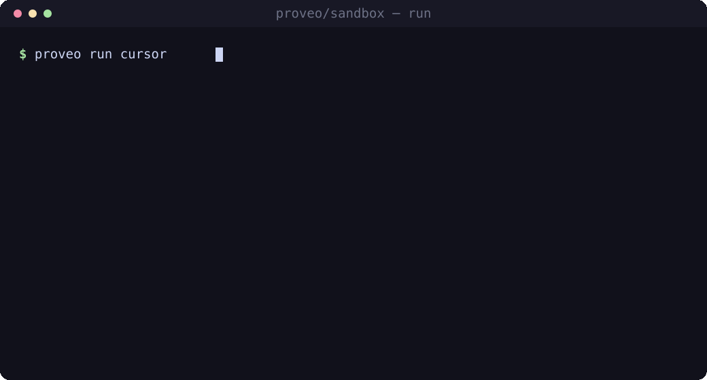
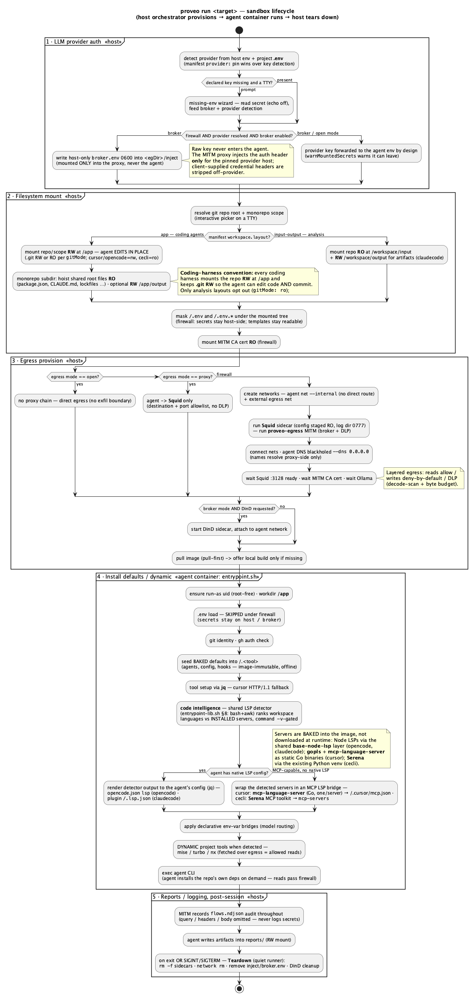
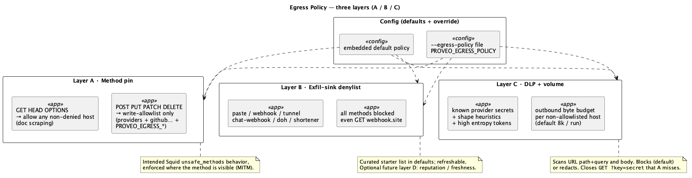

# proveo/sandbox

> Portable, hardened Docker sandboxes for AI coding agents — one command, any repo.



<sub>The capability picker on `tests/e2e/samples`. Record a live terminal version with `vhs _spec/assets/hero.tape`.</sub>

`proveo run <agent>` drops a coding agent (opencode, Claude Code, Cursor, cecli) into an
**ephemeral, hardened container** scoped to your repo — with enforced egress, a credential
broker that keeps API keys **out of the agent**, opt-in Playwright/browser and Docker-in-Docker,
and local-model support. No per-tool setup.

## Install

```sh
curl -fsSL https://proveo.ca/cli/install.sh | bash      # Linux · macOS · FreeBSD
```
```powershell
irm https://proveo.ca/cli/install.ps1 | iex             # Windows
```

Checksum-verified static binaries (amd64 + arm64).

## Quickstart — try it on the sample

The repo ships a **polyglot monorepo sample** (Go API · Rust harness · Bun/TS TUI · TS workspace
package) at [`tests/e2e/samples/`](tests/e2e/samples) — the same workspace the E2E suite drives.

```bash
cd tests/e2e/samples

proveo run opencode                          # capability picker (Tab: browser / DinD), then boots
proveo run cursor                            # broker egress (Cursor inference is vendor-pinned)
proveo run claudecode --local-model gemma4   # fully local via an Ollama sidecar — no cloud key
```

`proveo run` opens a **capability picker** — *press tab to add an option (browser, DinD), or
enter to continue* — then launches the agent against your repo with the guarantees below.

## Agents & variants

| Agent | Images | Notes |
| --- | --- | --- |
| **opencode** | `opencode` · `opencode-browser` | subagent crew; native LSP |
| **Claude Code** | `claudecode` (+ `-solo`, `-sol`, `-browser`) | MCP / solo / Solidity toolchain |
| **Cursor** | `cursor` · `cursor-browser` | vendor-pinned inference → broker egress |
| **cecli** | `cecli` | aider fork (Python) |

`-browser` variants add **Playwright + Chromium** (opt-in via the picker, sharing one Chromium
layer). Local models (`--local-model`) work for opencode, Claude Code, and cecli; Cursor is
vendor-pinned.

## How it works

Every run is a host-orchestrated, ephemeral sandbox: detect provider auth → mount the repo →
provision egress → boot the agent → record + tear down.



## Security — egress & credentials

The default `--egress-mode firewall` routes the agent through a MITM proxy + Squid allowlist with
a DLP scan, plus a **credential broker** that injects your API key **host-side** so it never
enters the agent (the container only ever sees a sentinel).



| Mode | Credentials | Egress |
| --- | --- | --- |
| **firewall** | brokered — real key only on the proxy sidecar | allowlist + DLP scan |
| **broker** | forwarded into the container (dev) | direct bridge |
| **proxy** | in-process | Squid allowlist (no TLS inspection) |

Keep `.env` on the **host** — do not bind-mount it into the agent.

## Specs

Architecture, the full egress policy, testing strategy, and the
[Docker-Sandbox experiment](_spec/experiments/docker-sandbox.puml) live in [`_spec/`](_spec)
as PlantUML diagrams + notes. Conventions: [`CONVENTIONS.md`](CONVENTIONS.md).
